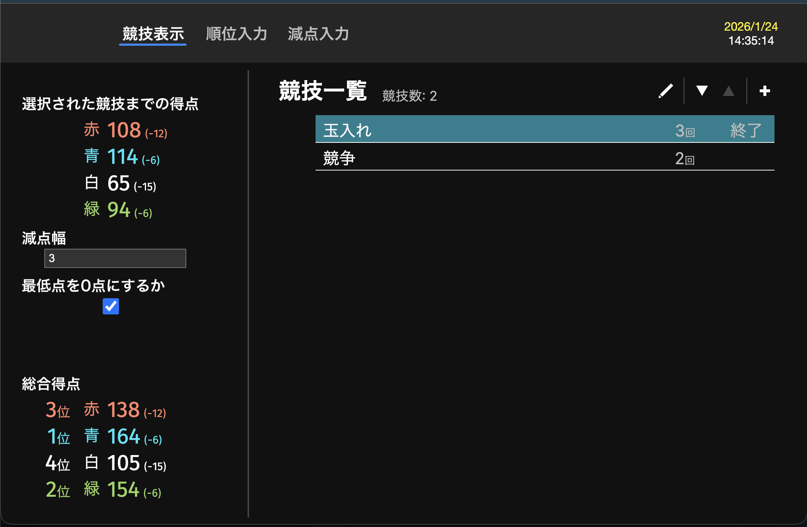

# FeScore

チーム対抗イベント（体育祭・運動会など）の得点管理ツール

## 概要

**FeScore** は、体育祭・運動会・学内イベントなどで使用できる、チームごとの得点をリアルタイムに管理・表示するスコアボードアプリです。（現状は赤・青・白・緑の4チームの場合に限定）

- 順位を自動計算
- チームごとの得点を簡単に追加・減算
- 競技順位を即座に入力
- 同じ競技を複数回実施可能
- 減点処理に特化したインターフェース

## スクリーンショット



## ビルド・実行

### 動作要件
- [Node.js](https://nodejs.org/)
- [npm](https://www.npmjs.com/)

### セットアップ
```bash
npm install
```

### 実行
```bash
npm start
```

### ビルド
```bash
npm run build
```

## TODO

- チーム数とチーム名のカスタマイズ
- 得点履歴の表示
- 歴代スコアの保存・読み込み機能
